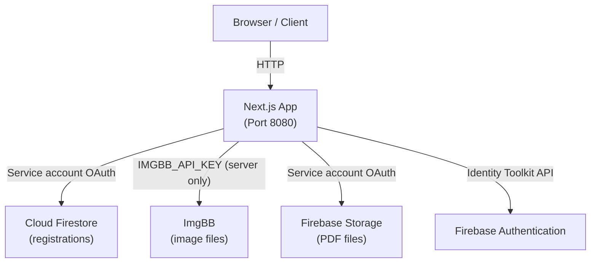
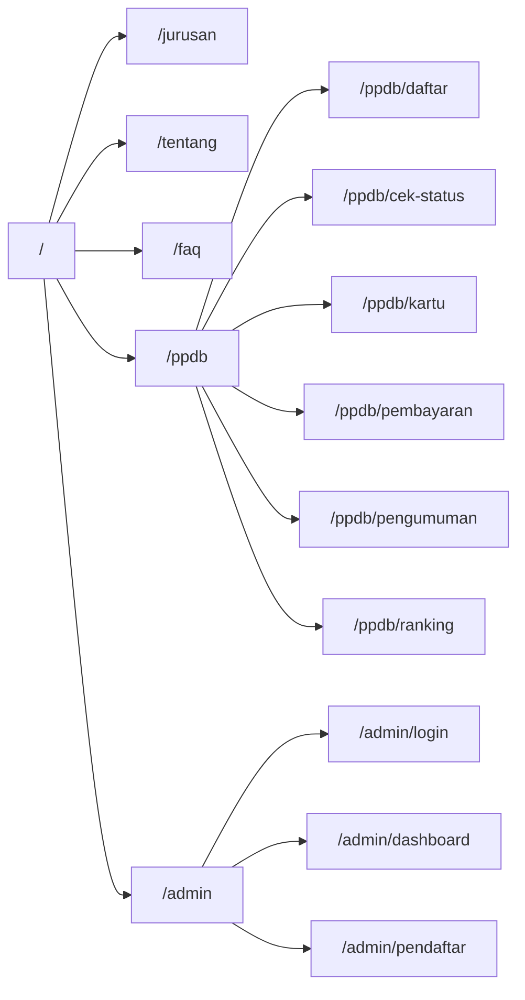
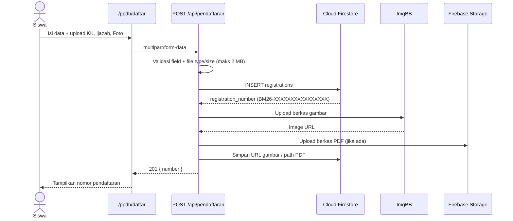
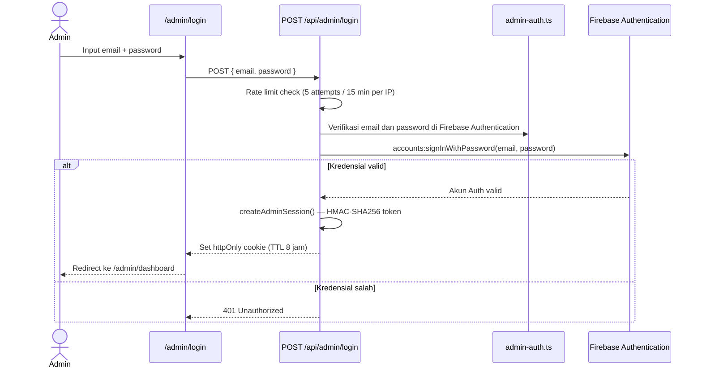
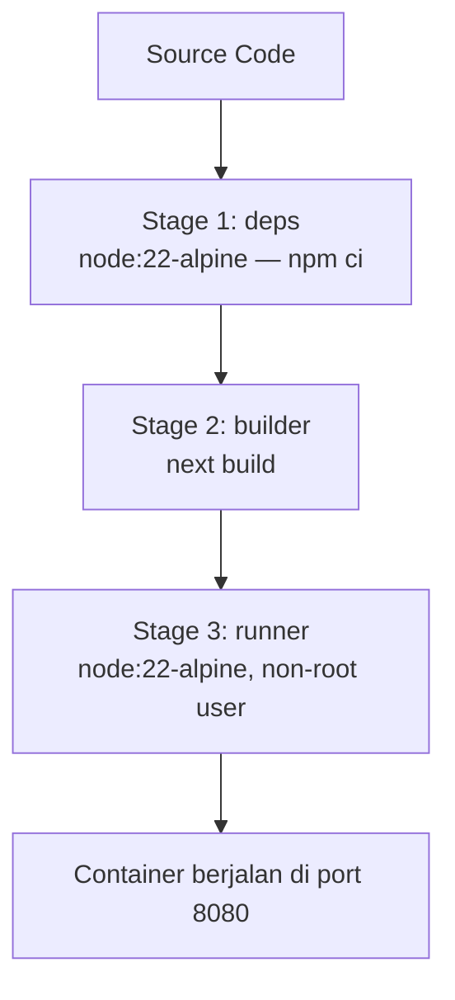

# PPDB SMK Bani Masum

Sistem informasi penerimaan peserta didik baru untuk SMK Bani Masum. Aplikasi ini menangani seluruh alur pendaftaran secara online — mulai dari pengisian formulir, upload dokumen, hingga pengecekan status — serta dilengkapi panel admin untuk mengelola data pendaftar.

---

## Stack

Dibangun di atas **Next.js 16** dengan App Router dan dikompilasi ke mode `standalone` agar mudah di-deploy menggunakan Docker. Bahasa yang digunakan TypeScript di seluruh codebase.

Untuk styling menggunakan **Tailwind CSS 4** dengan animasi dari **Framer Motion**. Data pendaftar disimpan di **Cloud Firestore**, berkas gambar di **ImgBB**, dokumen PDF di **Firebase Cloud Storage**, dan akun admin diverifikasi dengan **Firebase Authentication**. Endpoint server memakai service account Firebase melalui REST API. Sesi admin menggunakan cookie httpOnly bertanda tangan HMAC-SHA256.

---

## Struktur Aplikasi

```
ppdb_smk_bani_masum/
├── app/
│   ├── admin/              # Halaman admin (dashboard, login, pendaftar)
│   ├── api/
│   │   ├── admin/
│   │   │   ├── login/      # POST login, DELETE logout
│   │   │   └── pendaftar/  # GET list pendaftar (admin only)
│   │   └── pendaftaran/    # GET cek status, POST daftar baru
│   ├── components/         # Shared UI components
│   ├── lib/
│   │   ├── admin-auth.ts   # HMAC session + credential verification
│   │   └── ppdb-data.ts    # Data statis: jadwal, jurusan, galeri
│   ├── ppdb/               # Alur PPDB publik
│   └── layout.tsx
├── firestore.rules
├── firestore.indexes.json
├── storage.rules
├── public/
├── Dockerfile
├── docker-compose.yml
└── .dockerignore
```

---

## Arsitektur

### Gambaran Sistem



### Rute Aplikasi



### Alur Pendaftaran



### Alur Login Admin



### Docker Build



---

## Setup Development

Pastikan sudah punya Node.js 22+ dan npm 10+.

```bash
# Clone dan install
npm install

# Jalankan dev server
npm run dev
```

Buka `http://localhost:8080`.

Konfigurasi Firebase web, service account Firebase, dan API key ImgBB disimpan di kode. `.env.local` tidak diperlukan saat menjalankan atau men-deploy aplikasi. Nilai konfigurasi server berada di `app/lib/private-config.ts` dan hanya boleh diimpor oleh kode server.

Aktifkan **Email/Password** pada Firebase Authentication dan buat akun yang akan digunakan oleh panitia. Semua akun Firebase Authentication yang berhasil login dapat membuka area admin, jadi jangan aktifkan pendaftaran akun publik jika tidak semua pengguna boleh mengakses data pendaftar. Buat Firestore default database di project `ppdb-smk-bm`, lalu terapkan `firestore.rules`. Service account di konfigurasi harus memiliki role `Cloud Datastore User` (`roles/datastore.user`) dan `Storage Object Admin`.

### Deploy ke Vercel

Vercel tidak memerlukan environment variable untuk konfigurasi aplikasi ini. Kredensial server tertanam di source dan hanya digunakan route handler server; pastikan repository dan akses deployment dibatasi. Jika repository pernah dibuat publik atau kredensial pernah terekspos, cabut dan ganti service account key serta API key ImgBB.

`ADMIN_SESSION_SECRET` opsional. Tanpanya, server membuat secret acak untuk sesi yang berlaku sampai server dimulai ulang. Untuk sesi yang bertahan saat restart, atur secret sebagai environment variable deployment dengan:

```bash
node -e "console.log(require('crypto').randomBytes(32).toString('hex'))"
```

---

## Database dan dokumen

Pendaftar disimpan sebagai dokumen Cloud Firestore `registrations/{nomor-pendaftaran}`. Formulir publik menulis data melalui Firebase web API key dan aturan Firestore hanya mengizinkan pembuatan dokumen pendaftaran dengan skema valid. Ringkasan nama/status disimpan terpisah agar pencarian status tidak membuka NISN, nomor telepon, atau data dokumen. Terapkan aturan dari `firestore.rules` ke project Firebase sebelum menerima pendaftaran. Admin tetap memakai service account melalui IAM untuk membaca dan mengelola data. Gambar disimpan di ImgBB dan URL-nya dicatat di Firestore; berkas PDF disimpan di Firebase Storage. Dokumen yang diunggah ke ImgBB tersedia melalui URL publik.

```
Firebase Storage (PDF)/
└── BM26-<16-hex>/
    ├── kk-<uuid>
    ├── ijazah-<uuid>
    └── photo-<uuid>
```

---

## API

### Pendaftaran

**`POST /api/pendaftaran`** — Submit formulir pendaftaran. Menerima `multipart/form-data` dengan field teks (nama, NISN, tanggal lahir, telepon, nama orang tua, telepon orang tua, jurusan) dan tiga file dokumen (KK, ijazah, foto). Setiap file harus berformat PDF, JPG, atau PNG dengan ukuran maksimal 2 MB. Tidak memerlukan autentikasi.

Jika berhasil, API merespons `201` dengan nomor pendaftaran:
```json
{ "number": "BM26-XXXXXXXXXXXXXXXX" }
```

**`GET /api/pendaftaran?number=BM26-...`** — Cek status pendaftaran. Nomor harus sesuai pola `BM26-[A-F0-9]{16}`.

```json
{
  "registration": {
    "number": "BM26-XXXXXXXXXXXXXXXX",
    "name": "Nama Siswa",
    "status": "pending"
  }
}
```

### Admin

**`POST /api/admin/login`** — Login dengan `{ email, password }`; Firebase Authentication memverifikasi kredensial. Setiap akun Firebase Auth yang berhasil masuk mendapat akses admin. Rate limited 5 percobaan per IP per 15 menit. Jika berhasil, set cookie sesi httpOnly dengan TTL 8 jam.

**`DELETE /api/admin/login`** — Logout, menghapus cookie sesi.

**`GET /api/admin/pendaftar`** — Ambil seluruh data pendaftar. Memerlukan cookie sesi admin yang valid.

---

## Deploy dengan Docker

```bash
# Build dan jalankan
docker compose up --build -d

# Cek status
docker compose ps

# Lihat log
docker compose logs -f

# Hentikan
docker compose down
```

Aplikasi berjalan di `http://localhost:8080`.

### Deploy ke VPS

Upload project ke server, lalu pastikan `.env.local` tersedia di sana:

```bash
rsync -avz --exclude=node_modules --exclude=.next --exclude=.git \
  . user@server:/srv/ppdb

scp .env.local user@server:/srv/ppdb/.env.local
```

Kemudian di server:

```bash
cd /srv/ppdb
docker compose up --build -d
```

Arahkan traffic HTTPS dari Nginx atau Caddy ke port 8080. Contoh konfigurasi Nginx:

```nginx
server {
    listen 443 ssl;
    server_name ppdb.smkbanimasum.sch.id;

    ssl_certificate     /etc/letsencrypt/live/ppdb.smkbanimasum.sch.id/fullchain.pem;
    ssl_certificate_key /etc/letsencrypt/live/ppdb.smkbanimasum.sch.id/privkey.pem;

    location / {
        proxy_pass         http://127.0.0.1:8080;
        proxy_http_version 1.1;
        proxy_set_header   Host              $host;
        proxy_set_header   X-Real-IP         $remote_addr;
        proxy_set_header   X-Forwarded-For   $proxy_add_x_forwarded_for;
        proxy_set_header   X-Forwarded-Proto $scheme;
    }
}
```

---

## Catatan Keamanan

Beberapa hal yang perlu diperhatikan saat deploy:

- Kredensial akun admin diverifikasi oleh Firebase Authentication. Akun Firebase Auth yang dapat login juga dapat mengakses area admin.
- Firebase Authentication memverifikasi email dan password; cookie sesi aplikasi ditandatangani dengan HMAC-SHA256.
- Token sesi ditandatangani dengan HMAC-SHA256 menggunakan `ADMIN_SESSION_SECRET` jika dikonfigurasi, atau secret acak per proses jika tidak.
- Cookie sesi bersifat `httpOnly`, `secure`, dan `sameSite=strict` — tidak bisa dibaca JavaScript dan hanya dikirim lewat HTTPS.
- Cloud Firestore dan Firebase Storage diakses server side dengan service account. PDF disajikan admin melalui signed URL berumur 5 menit; gambar diunggah ke ImgBB dari server dan URL-nya disimpan di Firestore.
- Firestore mengizinkan formulir publik membuat pendaftaran dengan skema terbatas dan hanya mengizinkan pencarian dokumen ringkasan status satu per satu. Data pendaftar lengkap tetap privat; Firebase Storage menolak akses langsung dari browser.
- Container berjalan sebagai user non-root (`nextjs:nodejs`).
- File `.env.local` tidak boleh di-commit ke repository.

---

## Program Keahlian

**RPL — Teknik Komputer dan Jaringan**
Fokus pada pengembangan aplikasi, website, dan solusi digital untuk industri.

**TBSM — Teknik dan Bisnis Sepeda Motor**
Mencakup perawatan mesin, kelistrikan, dan diagnosis kendaraan modern.
